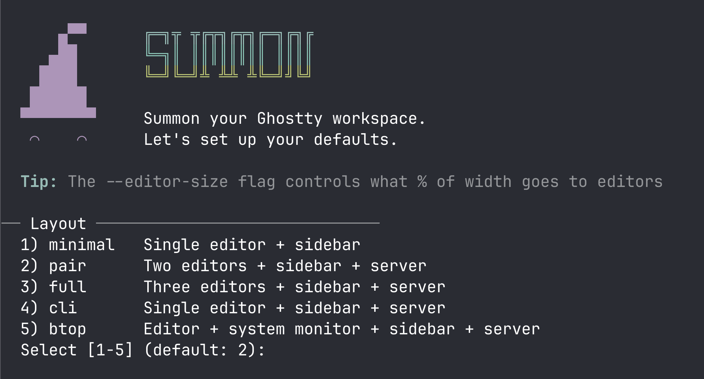

# Summon your Ghostty workspace!


[](https://github.com/juan294/summon/actions/workflows/ci.yml)
[](https://github.com/juan294/summon/actions/workflows/codeql.yml)
[](https://www.npmjs.com/package/summon-ws)
[](https://nodejs.org)
[](https://www.typescriptlang.org)
[](./LICENSE)

Summon your Ghostty workspace with one command. Native splits, no tmux.

---

## Install

```bash
npm i -g summon-ws
```

Requires Node >= 18, macOS, and [Ghostty](https://ghostty.org) 1.3.1+.

## Quick Start

```bash
summon .                          # launch workspace in current directory
```

On first run, an interactive setup wizard guides you through choosing your editor, sidebar, layout, shell, and Starship prompt theme. You can re-run it anytime:

```bash
summon setup                      # reconfigure workspace defaults
```

<p align="center">
  
</p>

Register projects for quick access:

```bash
summon add myapp ~/code/myapp     # register a project
summon myapp                      # launch by project name
```

## How It Works

Summon generates and executes AppleScript that drives Ghostty's native split system. No terminal multiplexer -- just native Ghostty panes with commands running in each one.

## Default Layout

```
summon .    (panes=2, editor=<your editor>, sidebar=<your sidebar>, shell=true)

+-------------------- 75% ---------------------+------ 25% ------+
|                    |                          |                 |
|                    |    editor (2)            |                 |
|    editor (1)      |                          |    sidebar      |
|                    +--------------------------+                 |
|                    |                          |                 |
|                    |    shell                 |                 |
|                    |                          |                 |
+--------------------+--------------------------+-----------------+
      left col             right col                sidebar
```

## Layout Presets

| Preset | Panes | Shell | Use case |
|---|---|---|---|
| `full` | 3 | yes | Multi-agent coding + shell |
| `pair` | 2 | yes | Two editors + shell |
| `minimal` | 1 | no | Simple editor + sidebar only |
| `cli` | 1 | yes | CLI tool development -- editor + shell |
| `btop` | 2 | yes | System monitoring -- editor + btop + shell |

```bash
summon . --layout minimal         # 1 editor pane, no shell
summon . -l pair                  # 2 editors + shell
```

## Custom Layouts

Define arbitrary split configurations using a tree DSL:

```bash
summon layout create              # interactive layout builder wizard
summon . --layout my-layout       # launch with a custom layout
```

Custom layouts are saved to `~/.config/summon/layouts/` and can be used anywhere a preset name is accepted.

## Per-project Config

Drop a `.summon` file in your project root to override machine-level config:

```ini
# .summon
layout=minimal
editor=vim
shell=npm run dev
theme=nord
env.PORT=3000
```

Config resolution order: **CLI flags > .summon > machine config > preset > defaults**

## Commands

| Command | Description |
|---|---|
| `summon <target>` | Launch workspace (project name, path, or `.`) |
| `summon setup` | Interactive setup wizard — choose editor, sidebar, layout, shell, Starship theme |
| `summon add <name> <path>` | Register a project name to a directory |
| `summon remove <name>` | Remove a registered project |
| `summon list` | List all registered projects |
| `summon set <key> [value]` | Set a machine-level config value |
| `summon config` | Show current machine configuration |
| `summon open` | Select and launch a registered project interactively |
| `summon export [path]` | Export resolved config as a `.summon` file |
| `summon doctor [--fix]` | Check Ghostty config for recommended settings (--fix auto-adds missing) |
| `summon freeze <name>` | Save current resolved config as a reusable custom layout |
| `summon keybindings [--vim]` | Generate Ghostty key table config for pane navigation |
| `summon layout <action>` | Manage custom layouts (create, save, list, show, delete, edit) |
| `summon completions <shell>` | Generate shell completion script (`zsh`, `bash`) |

## CLI Flags

| Flag | Description |
|---|---|
| `-l, --layout <preset>` | Use a layout preset (`minimal`, `full`, `pair`, `cli`, `btop`) |
| `-e, --editor <cmd>` | Override editor command |
| `-p, --panes <n>` | Override number of editor panes |
| `--editor-size <n>` | Override editor width percentage |
| `-s, --sidebar <cmd>` | Override sidebar command |
| `--shell <value>` | Shell pane: `true`, `false`, or a command |
| `--auto-resize` | Resize sidebar to match editor-size (default: on) |
| `--no-auto-resize` | Disable auto-resize |
| `--starship-preset <preset>` | Starship prompt preset name (per-workspace) |
| `--theme <name>` | Ghostty theme for workspace |
| `--font-size <n>` | Override font size for workspace panes |
| `--env KEY=VALUE` | Set environment variable (repeatable) |
| `--on-start <cmd>` | Run a command before workspace creation |
| `--new-window` | Open workspace in a new Ghostty window |
| `--fullscreen` | Start workspace in fullscreen mode |
| `--maximize` | Start workspace maximized |
| `--float` | Float workspace window on top |
| `-n, --dry-run` | Print generated AppleScript without executing |
| `-h, --help` | Show help message |
| `-v, --version` | Show version number |

## Config Keys

| Key | Default | Description |
|---|---|---|
| `editor` | *(set during setup)* | Command launched in editor panes |
| `sidebar` | `lazygit` | Command launched in the sidebar pane |
| `panes` | `2` | Number of editor panes |
| `editor-size` | `75` | Width percentage for the editor grid |
| `shell` | `true` | Shell pane: `true` (shell), `false` (none), or a command |
| `layout` | | Default layout preset |
| `auto-resize` | `true` | Auto-resize sidebar to match editor-size |
| `starship-preset` | | Starship prompt theme preset (per-workspace) |
| `theme` | | Ghostty theme for workspace |
| `font-size` | | Font size for workspace panes (points) |
| `on-start` | | Command to run before workspace creation |
| `new-window` | `false` | Open workspace in a new Ghostty window |
| `fullscreen` | `false` | Start workspace in fullscreen mode |
| `maximize` | `false` | Start workspace maximized |
| `float` | `false` | Float workspace window on top |

Machine config is stored at `~/.config/summon/config`:

```bash
summon set editor vim               # use vim as the editor
summon set shell "npm run dev"      # run a command in the shell pane
summon set layout minimal           # default to minimal preset
summon set starship-preset tokyo-night  # per-workspace Starship prompt theme
summon set theme nord                  # Ghostty theme for workspace
summon set font-size 14                # font size for workspace panes
summon set on-start "npm install"      # run before workspace creation
summon set new-window true             # always open in a new window
summon set env.API_KEY sk-123          # per-workspace environment variable
```

## Docs

- [Workspace Gallery](https://juan294.github.io/summon/gallery/) -- visual showcase of layout examples
- [Architecture](docs/architecture.md) -- module map, AppleScript generation, layout algorithm
- [User Manual](docs/user-manual.md) -- full command reference, walkthrough, troubleshooting
- [Changelog](CHANGELOG.md) -- release history
- [Publishing](docs/publishing.md) -- npm publish checklist

## Contributing

Contributions are welcome! Please read the [Contributing Guide](CONTRIBUTING.md) for details on the development workflow, commit conventions, and PR guidelines.

## Code of Conduct

This project follows the [Contributor Covenant Code of Conduct](CODE_OF_CONDUCT.md). By participating, you are expected to uphold this code.

## Environment Variables

| Variable | Description |
|---|---|
| `SHELL` | Login shell used to execute pane commands. Must be an absolute path. Falls back to `/bin/bash` if unset or invalid. |
| `NO_COLOR` | When set, disables ANSI colors in the setup wizard. Follows the [NO_COLOR](https://no-color.org) standard. |
| `COLORTERM` | When set to `truecolor` or `24bit`, the setup wizard shows colored palette swatches for Starship presets. |
| `SUMMON_WORKSPACE` | Set to `1` inside summon workspaces. Used to detect and warn about nested launches. |
| `EDITOR` | Editor used by `summon layout edit`. Falls back to `vi` if unset. |

## Trust Model

`.summon` files configure commands that summon executes in each pane (`editor`, `sidebar`, `shell`, `on-start`). Running `summon .` in a directory will execute whatever commands its `.summon` file specifies -- this is the same trust model as `Makefile`, direnv `.envrc`, or VS Code `.vscode/tasks.json`.

When a `.summon` file contains command values with shell metacharacters (`;`, `|`, `&`, `` ` ``, `$(`, `${`, `<`, `>`), summon displays the commands and prompts for confirmation before executing (`confirmDangerousCommands`). In non-interactive environments (piped input, CI), execution is refused outright. This check is skipped for `--dry-run` since no commands are executed.

**`on-start` note:** The `on-start` hook executes its value via a shell (`execSync`) rather than `execFileSync`. This is intentional -- `on-start` supports complex shell commands like `docker compose up -d && npm install` that require shell interpretation. The `editor`, `sidebar`, and `shell` commands are validated against `SAFE_COMMAND_RE` before execution, but `on-start` is not, since it is designed to run arbitrary shell snippets. The `confirmDangerousCommands` safety net still applies: if `on-start` is set in a `.summon` file and contains shell metacharacters, the user is prompted before execution.

**Always review `.summon` files before running summon in untrusted repositories, paying particular attention to `on-start` values which execute as shell commands.**

## Security

To report a vulnerability, please follow the [Security Policy](SECURITY.md). Do not open a public issue.

## License

[MIT](./LICENSE)
