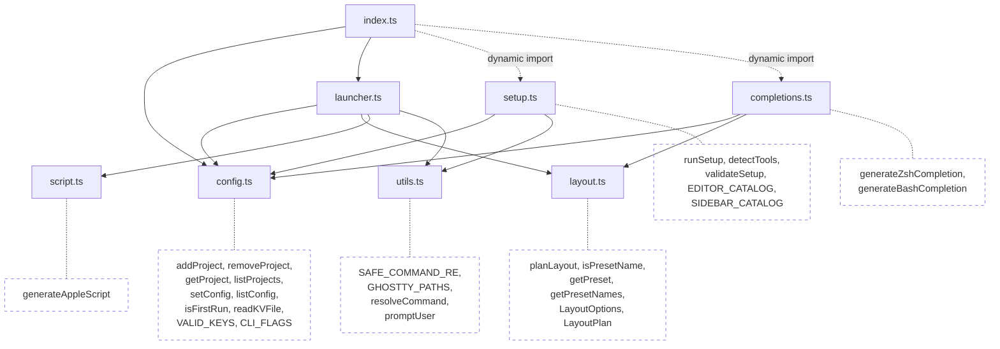
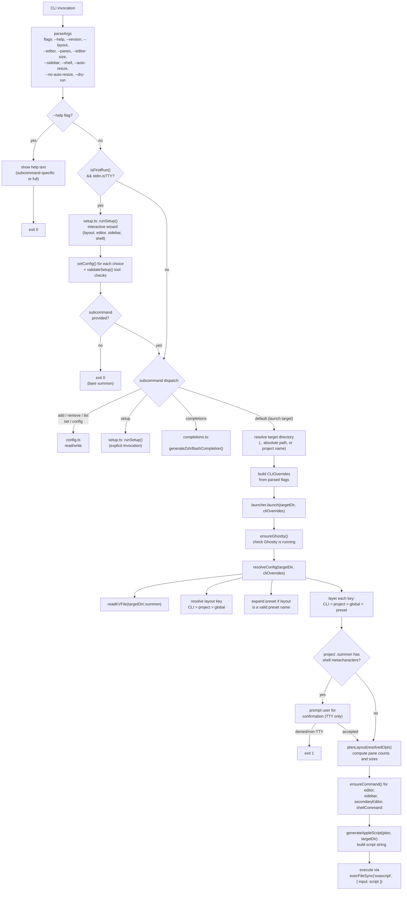
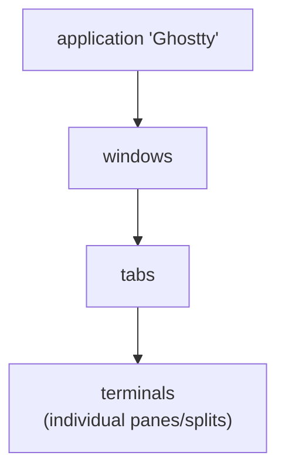

# Architecture

Technical reference for contributors.

## Module Map

| Module | Role | Side Effects | Dependencies |
|--------|------|:------------:|--------------|
| `index.ts` | CLI entry point — parseArgs, subcommand dispatch, first-run detection | yes | config, launcher, setup (dynamic) |
| `launcher.ts` | Orchestrator — config resolution, command checks, script execution via osascript | yes | config, layout, script, utils |
| `config.ts` | Config file read/write (`~/.config/summon/` and `.summon`), first-run detection | yes | Node stdlib only |
| `setup.ts` | Interactive setup wizard — TUI primitives, tool catalogs, numbered-selection flow | yes | config, utils |
| `utils.ts` | Shared utilities — `SAFE_COMMAND_RE`, `GHOSTTY_PATHS`, `resolveCommand`, `promptUser` (shared readline wrapper) | yes | Node stdlib only |
| `layout.ts` | Layout calculation and presets | **pure** | none |
| `script.ts` | AppleScript generator — builds script string from LayoutPlan | **pure** | none |
| `completions.ts` | Shell completion script generator (zsh, bash) | **pure** | config, layout |
| `validation.ts` | Input validation helpers (`parseIntInRange`) | **pure** | none |
| `globals.d.ts` | Build-time constant declarations (`__VERSION__`) | — | — |
| `*.test.ts` | Co-located unit tests (Vitest) | — | — |

### Dependency Graph



`layout.ts`, `script.ts`, `completions.ts`, and `validation.ts` are pure modules with no side effects. `config.ts` and `utils.ts` only use Node stdlib. `setup.ts` and `completions.ts` are loaded via dynamic `import()` from `index.ts` — they're only parsed when needed (`summon setup` or `summon completions`), keeping normal launch times unaffected.

All interactive prompts in `setup.ts` (`numberedSelect`, `confirm`, `selectToolFromCatalog`, `textInput`) use the shared `promptUser()` helper from `utils.ts`, which wraps readline creation, question, close, and trim in a single async call.

Note: `index.ts` defines `DISPLAY_COMMAND_KEYS` (array of `["editor", "sidebar"]`) for config display formatting, while `launcher.ts` defines a separate `COMMAND_KEYS` Set (includes `"shell"`) for security validation of `.summon` file commands. These are intentionally separate with different names to avoid confusion.

## Data Flow



## Setup Wizard

`setup.ts` implements the interactive first-run onboarding wizard. It is loaded via dynamic `import()` from `index.ts` to avoid adding to the startup cost of normal launches.

### First-Run Detection

`isFirstRun()` in `config.ts` checks whether `~/.config/summon/config` exists. It does NOT call `ensureConfig()` — the check must not create the file as a side effect.

The auto-trigger in `index.ts` fires when:
1. `isFirstRun()` returns `true` (no config file)
2. `process.stdin.isTTY` is truthy (interactive terminal)
3. The subcommand is not a config management command (add, remove, list, set, config, setup)

### Wizard Flow

1. **Welcome banner** — wizard hat mascot (magenta Unicode art), colored SUMMON logo (cyan→green gradient), and a random rotating tip from 10 feature-discovery hints. Respects `NO_COLOR`.
2. **Layout selection** — numbered list of 5 presets with ASCII diagrams
3. **Editor selection** — catalog of common editors, detected via `resolveCommand()`, sorted available-first
4. **Sidebar selection** — catalog of common sidebar tools, same detection pattern
5. **Shell selection** — plain shell, disabled, or custom command
6. **Summary** — display chosen configuration
7. **Confirmation** — Y/n; declining loops back to step 2
8. **Validation** — check each chosen command with `resolveCommand()`, check Ghostty installation, show install hints for missing tools
9. **Save** — write each key via `setConfig()`

### Tool Catalogs

Editors and sidebar tools are defined as `ToolEntry[]` catalogs in `setup.ts`. Each entry has `cmd` (binary name), `name` (display name), and `desc` (description). The `detectTools()` function runs `resolveCommand()` against each catalog entry and returns `DetectedTool[]` with an `available` boolean.

### Color Support

ANSI colors are controlled by the `useColor` flag, computed at module load:

```typescript
const useColor = !!(process.stdout.isTTY && !process.env.NO_COLOR);
```

All color functions (`bold`, `dim`, `green`, `yellow`, `cyan`) pass through when `useColor` is false, per the [no-color.org](https://no-color.org/) convention.

### Code Splitting

tsup automatically code-splits `setup.ts` and `completions.ts` into separate chunks. These chunks are only loaded when needed (`summon setup` or `summon completions`), keeping the main entry point lean for normal workspace launches.

## AppleScript Generation

`script.ts` exports a pure function `generateAppleScript(plan, targetDir)` that returns a string. The generated script:

1. Creates a `surface configuration` with the target working directory
2. Creates a new Ghostty window with that configuration
3. Captures the root terminal (first pane)
4. Splits for sidebar (direction `right`)
5. Splits for right column editors (direction `right` from root)
6. Splits left column vertically for additional editor panes (direction `down`)
7. Splits right column vertically for additional editors + shell pane (direction `down`)
8. Sends commands to each pane via `input text` + `send key "enter"`
9. Focuses the root editor pane

### AppleScript Object Model



Key commands used:
- `new surface configuration` -- create config with working directory, command, etc.
- `new window with configuration` -- create window
- `split <terminal> direction <dir> with configuration` -- create split
- `input text "<cmd>" to <terminal>` -- send command text
- `send key "enter" to <terminal>` -- press enter
- `focus <terminal>` -- focus a pane

### No tmux, No Session Persistence

Unlike termplex, summon does not create persistent sessions. Each `summon` invocation creates a new Ghostty window with splits. Closing the window ends everything. There is no detach/reattach. This is a Ghostty limitation -- if they add session persistence in the future, summon can adopt it.

## Shell Completions

`completions.ts` generates shell completion scripts for zsh and bash. It is loaded via dynamic `import()` from `index.ts` when the user runs `summon completions <shell>`.

The generated scripts:
- Complete subcommands, registered project names, and directories for the first positional argument
- Complete CLI flags when the cursor follows `--`
- Complete layout preset names after `--layout` or `summon set layout`
- Complete config keys after `summon set`
- Complete shell names (`zsh`, `bash`) after `summon completions`

Project names are read dynamically from `~/.config/summon/projects` at completion time — no Node.js process is spawned per tab press, so completions are instant.

The module imports `VALID_KEYS` and `CLI_FLAGS` from `config.ts` and `getPresetNames()` from `layout.ts` to keep completable tokens in sync with the source of truth.

## Security

### Command Name Validation

`SAFE_COMMAND_RE` in `utils.ts` (`/^[a-zA-Z0-9_][a-zA-Z0-9_.+-]*$/`) validates command binary names before they're passed to `command -v` or executed. This prevents injection via crafted command names.

### Shell Metacharacter Detection

When `launcher.ts` loads a `.summon` project file, it scans command values (`editor`, `sidebar`, `shell`) for shell metacharacters: `;`, `|`, `&`, `` ` ``, `$(`, `<`, `>`.

If any are found:
- **TTY**: displays the suspicious commands and prompts for Y/n confirmation (default: no)
- **Non-TTY**: refuses to execute and exits with an error
- **Dry-run**: skips the check entirely (no commands are executed)

Only `.summon` files are checked. CLI flags and machine config (`~/.config/summon/config`) are trusted sources.

### SHELL Validation

`launcher.ts` validates `process.env.SHELL` against `/^\/[a-zA-Z0-9_/.-]+$/`. If the value is missing or unsafe, it falls back to `/bin/bash` with a warning.

### osascript Execution

`executeScript` uses `execFileSync` (not `execSync`) to pass the generated AppleScript to `osascript` via stdin, avoiding shell interpretation of the script content.

## Config Resolution

`resolveConfig()` in `launcher.ts` merges configuration from multiple sources:


1. Read project `.summon` file via `readKVFile(join(targetDir, ".summon"))`
2. Resolve the `layout` key (CLI > project > global) and expand the matching preset as a base
3. For each config key (`editor`, `sidebar`, `panes`, `editor-size`, `shell`), pick the highest-priority value
4. Return partial `LayoutOptions` -- `planLayout()` fills remaining defaults

## Layout Presets

Defined in `layout.ts` as a `Record<PresetName, Partial<LayoutOptions>>`:

| Preset | `editorPanes` | `shell` | `secondaryEditor` |
|---|---|---|---|
| `minimal` | 1 | `"false"` | |
| `full` | 3 | `"true"` | |
| `pair` | 2 | `"true"` | |
| `cli` | 1 | `"true"` | |
| `btop` | 2 | `"true"` | `"btop"` |

### Preset Layouts

Each diagram shows the resulting Ghostty window. The sidebar (lazygit) is always on the right at `100 - editorSize`% width.

#### `minimal` — single editor, no shell

```
┌─────────────────────────────┬───────────┐
│                             │           │
│                             │           │
│           editor            │  lazygit  │
│                             │           │
│                             │           │
└─────────────────────────────┴───────────┘
            75%                    25%
```

#### `full` — 3 editors + shell (default)

```
┌──────────────┬──────────────┬───────────┐
│              │              │           │
│   editor 1   │   editor 3   │           │
│              │              │           │
├──────────────┼──────────────┤  lazygit  │
│              │              │           │
│   editor 2   │    shell     │           │
│              │              │           │
└──────────────┴──────────────┴───────────┘
         75% (2 columns)           25%
```

#### `pair` — 2 editors + shell

```
┌──────────────┬──────────────┬───────────┐
│              │              │           │
│              │   editor 2   │           │
│              │              │           │
│   editor 1   ├──────────────┤  lazygit  │
│              │              │           │
│              │    shell     │           │
│              │              │           │
└──────────────┴──────────────┴───────────┘
         75% (2 columns)           25%
```

#### `cli` — single editor + shell

```
┌──────────────┬──────────────┬───────────┐
│              │              │           │
│              │              │           │
│    editor    │    shell     │  lazygit  │
│              │              │           │
│              │              │           │
└──────────────┴──────────────┴───────────┘
         75% (2 columns)           25%
```

#### `btop` — editor + btop + shell

```
┌──────────────┬──────────────┬───────────┐
│              │              │           │
│              │     btop     │           │
│              │              │           │
│    editor    ├──────────────┤  lazygit  │
│              │              │           │
│              │    shell     │           │
│              │              │           │
└──────────────┴──────────────┴───────────┘
         75% (2 columns)           25%
```

## Layout Algorithm

Given `N` editor panes (default 3) and shell toggle:

1. **Left column**: `ceil(N/2)` editor panes
2. **Right column**: `N - ceil(N/2)` editor panes + (1 shell pane if `hasShell`)
3. **Sidebar**: separate column at `100 - editorSize`% width

### Shell Pane

| Input | `hasShell` | `shellCommand` |
|---|---|---|
| `"true"` | `true` | `null` (plain shell) |
| `"false"` or `""` | `false` | `null` |
| anything else | `true` | the input string |

### Secondary Editor

`secondaryEditor` allows a preset to specify a different command for right-column editor panes. Used by the `btop` preset to run `btop` in the right column while the left column runs the primary editor.

### Split Percentage Formula

When splitting `N` panes into a column, each split uses:

```
pct(i) = floor((N - i) / (N - i + 1) * 100)
```

where `i` is the 1-based index of the split. This produces equal-height panes.

## Config Storage

### Machine-level

Config files live at `~/.config/summon/`:

| File | Purpose |
|---|---|
| `config` | Machine-level settings (editor, sidebar, panes, editor-size, shell, layout) |
| `projects` | Project name-to-path mappings |

Both use `key=value` format, one entry per line.

### Per-project

A `.summon` file in the project root uses the same `key=value` format.

## Build Pipeline

1. **tsup** compiles `src/index.ts` to `dist/index.js` (ESM, target node18, minified)
2. **Shebang injection**: `#!/usr/bin/env node` banner prepended
3. **Version injection**: `__VERSION__` replaced with `package.json` version at build time
4. **Code splitting**: `setup.ts` and `completions.ts` are auto-split into separate chunks via dynamic `import()`
5. **prepublishOnly**: runs `pnpm run build` before any `npm publish`

The `files` field in package.json limits the published package to `dist/` only. Total bundle size is ~33 KB across 6 chunks.
