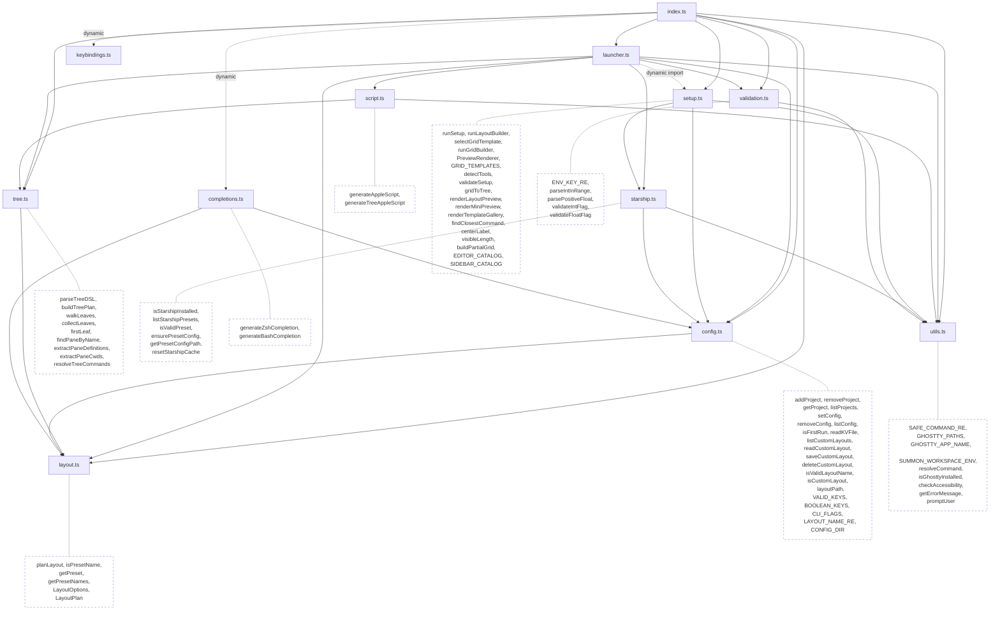
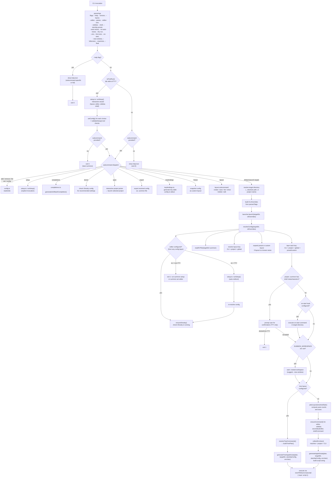
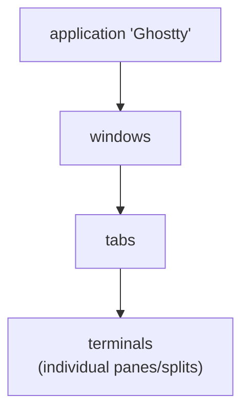

# Architecture

Technical reference for contributors.

## Module Map

| Module | Role | Side Effects | Dependencies |
|--------|------|:------------:|--------------|
| `index.ts` | CLI entry point — parseArgs, subcommand dispatch, first-run detection | yes | config, launcher, validation, utils, setup (static + dynamic), completions (dynamic), keybindings (dynamic), tree (static + dynamic), layout (static + dynamic) |
| `launcher.ts` | Orchestrator — config resolution, command checks, script execution via osascript | yes | config, layout, script, tree, utils, validation, starship, setup (dynamic) |
| `config.ts` | Config file read/write (`~/.config/summon/` and `.summon`), first-run detection | yes | Node stdlib only |
| `setup.ts` | Interactive setup wizard — TUI primitives, tool catalogs, numbered-selection flow | yes | config, utils, starship |
| `utils.ts` | Shared utilities — `SAFE_COMMAND_RE`, `GHOSTTY_PATHS`, `GHOSTTY_APP_NAME`, `SUMMON_WORKSPACE_ENV`, `resolveCommand`, `getErrorMessage`, `promptUser` | yes | Node stdlib only |
| `layout.ts` | Layout calculation and presets | **pure** | none |
| `script.ts` | AppleScript generator — builds script string from LayoutPlan or TreeLayoutPlan | **pure** | tree, utils |
| `completions.ts` | Shell completion script generator (zsh, bash) | **pure** | config, layout |
| `starship.ts` | Starship detection, preset listing, TOML config caching | yes | config, utils |
| `tree.ts` | Tree data model, DSL parser, plan builder (pure — no side effects) | **pure** | layout |
| `keybindings.ts` | Ghostty key table config generator (pure function) | **pure** | none |
| `validation.ts` | Input validation helpers (`ENV_KEY_RE`, `parseIntInRange`, `parsePositiveFloat`, `validateIntFlag`, `validateFloatFlag`) | **pure** | utils |
| `globals.d.ts` | Build-time constant declarations (`__VERSION__`) | — | — |
| `*.test.ts` | Co-located unit tests (Vitest) | — | — |

### Dependency Graph



`layout.ts`, `script.ts`, `tree.ts`, `completions.ts`, and `validation.ts` are pure modules with no side effects. `config.ts` and `utils.ts` only use Node stdlib. `starship.ts` handles Starship binary detection (cached), preset listing, and TOML config file generation — it depends on `config.ts` (for `CONFIG_DIR`) and `utils.ts` (for `resolveCommand`, `SAFE_COMMAND_RE`). `index.ts` statically imports `renderLayoutPreview` from `setup.ts`, `parseTreeDSL` from `tree.ts`, and exports from `layout.ts` for use in the `layout list` command and direct CLI handling. The full setup wizard, `completions.ts`, and `keybindings.ts` are still loaded via dynamic `import()` — they're only parsed when needed, keeping normal launch times unaffected. `launcher.ts` also dynamically imports `setup.ts` when no editor is configured, redirecting to the wizard on first launch.

All interactive prompts in `setup.ts` (`numberedSelect`, `confirm`, `selectToolFromCatalog`, `textInput`) use the shared `promptUser()` helper from `utils.ts`, which wraps readline creation, question, close, and trim in a single async call.

Note: `index.ts` defines `DISPLAY_COMMAND_KEYS` (array of `["editor", "sidebar"]`) for config display formatting, while `launcher.ts` defines a separate `COMMAND_KEYS` Set (includes `"shell"`) for security validation of `.summon` file commands. These are intentionally separate with different names to avoid confusion.

## Data Flow



## Setup Wizard

`setup.ts` implements the interactive first-run onboarding wizard. The full wizard is loaded via dynamic `import()` from `index.ts` to avoid adding to the startup cost of normal launches. However, `renderLayoutPreview` is statically imported by `index.ts` for the `layout list` command.

### First-Run Detection

`isFirstRun()` in `config.ts` checks whether `~/.config/summon/config` exists. It does NOT call `ensureConfig()` — the check must not create the file as a side effect.

The auto-trigger in `index.ts` fires when:
1. `isFirstRun()` returns `true` (no config file)
2. `process.stdin.isTTY` is truthy (interactive terminal)
3. The subcommand is not a config management command (add, remove, list, set, config, setup, doctor, open, export, layout, completions)

### Wizard Flow

1. **Welcome banner** — wizard hat mascot (magenta Unicode art), colored SUMMON logo (cyan→green gradient), and a random rotating tip from 10 feature-discovery hints. Respects `NO_COLOR`.
2. **Layout selection** — numbered list of 5 presets with ASCII diagrams, plus a "custom" option that flows into the layout builder
3. **Editor selection** — catalog of common editors, detected via `resolveCommand()`, sorted available-first (skipped for custom layouts)
4. **Sidebar selection** — catalog of common sidebar tools, same detection pattern (skipped for custom layouts)
5. **Shell selection** — plain shell, disabled, or custom command (skipped for custom layouts)
6. **Starship prompt theme** — if Starship is installed, shows available presets with true-color palette swatches for the 4 color-rich presets (pastel-powerline, tokyo-night, gruvbox-rainbow, catppuccin-powerline). Includes Skip and "Random (surprise me!)" options. Gracefully skipped if Starship is not installed.
7. **Summary** — display chosen configuration
8. **Confirmation** — Y/n; declining loops back to step 2
9. **Validation** — check each chosen command with `resolveCommand()`, check Ghostty installation, show install hints for missing tools (skipped for custom layouts)
10. **Save** — write each key via `setConfig()`

### Visual Layout Builder

The layout builder (`runLayoutBuilder`) provides a visual way to create custom layouts:

1. **Template gallery** — side-by-side mini diagrams of 7 common grid shapes (`GRID_TEMPLATES`), rendered via `renderMiniPreview()` and composed by `renderTemplateGallery()`. Adapts items per row to terminal width.
2. **Arrow-key grid builder** — selecting "Build from scratch" enters raw mode (`runGridBuilder`). Users sculpt a grid shape with arrow keys (←→ columns, ↑↓ panes, Tab/Shift+Tab focus). Uses `applyGridAction()` for immutable state management and `PreviewRenderer` for flicker-free in-place rendering.
3. **Command assignment** — sequential prompts for each pane command with in-place live preview. After each command entry, the layout diagram redraws in place via ANSI cursor control (`ansiUp`, `ansiClearDown`, `ansiSyncStart/End`). Unfilled cells show dimmed `?` placeholders.
4. **Validation** — commands validated against PATH with typo detection (`findClosestCommand` using Levenshtein distance). Closest match suggested if not found.

### Tool Catalogs

Editors and sidebar tools are defined as `ToolEntry[]` catalogs in `setup.ts`. Each entry has `cmd` (binary name), `name` (display name), and `desc` (description). The `detectTools()` function runs `resolveCommand()` against each catalog entry and returns `DetectedTool[]` with an `available` boolean.

### Color Support

ANSI colors are controlled by the `useColor` flag, computed at module load:

```typescript
const useColor = !!(process.stdout.isTTY && !process.env.NO_COLOR);
```

All color functions (`bold`, `dim`, `green`, `yellow`, `cyan`) pass through when `useColor` is false, per the [no-color.org](https://no-color.org/) convention.

### Code Splitting

tsup automatically code-splits `setup.ts` and `completions.ts` into separate chunks. These chunks are only loaded when needed (`summon setup` or `summon completions`), keeping the main entry point lean for normal workspace launches. Note: `renderLayoutPreview` is now statically imported from `setup.ts` by `index.ts` for the `layout list` command, while the full setup wizard remains dynamically loaded.

## AppleScript Generation

`script.ts` exports two pure functions: `generateAppleScript(plan, targetDir, starshipConfigPath, envVars)` for traditional grid layouts, and `generateTreeAppleScript(plan, targetDir, starshipConfigPath, envVars)` for tree-based custom layouts. Both return a string. Environment variables (including `STARSHIP_CONFIG` when a preset is configured) are set via Ghostty's `surface configuration` mechanism, which propagates them to all panes automatically (including new windows). Font size is also set via surface configuration when `--font-size` is provided. The traditional generator produces this script:

1. Creates a `surface configuration` with the target working directory, font size, and environment variables
2. Creates a new Ghostty window with that configuration (or reuses the front window unless `--new-window` is set)
3. Captures the root terminal (first pane)
4. Splits for sidebar (direction `right`)
5. Splits for right column editors (direction `right` from root)
6. Splits left column vertically for additional editor panes (direction `down`)
7. Splits right column vertically for additional editors + shell pane (direction `down`)
8. Sends commands to each pane: the root pane uses `input text` + `send key "enter"`, while non-root panes use `set initial input of cfg to "command\n"` in their surface configuration. This means non-root panes start as normal interactive login shells (all rc files sourced) and receive the command via PTY buffer injection.
9. Focuses the root editor pane

### AppleScript Object Model



Key commands used:
- `new surface configuration` -- create config with working directory, command, etc.
- `new window with configuration` -- create window
- `split <terminal> direction <dir> with configuration` -- create split
- `input text "<cmd>" to <terminal>` -- send command text
- `send key "enter" to <terminal>` -- press enter
- `focus <terminal>` -- focus a pane

### No tmux, No Session Persistence

Unlike termplex, summon does not create persistent sessions. Each `summon` invocation creates a new Ghostty window with splits. Closing the window ends everything. There is no detach/reattach. This is a Ghostty limitation -- if they add session persistence in the future, summon can adopt it.

## Shell Completions

`completions.ts` generates shell completion scripts for zsh and bash. It is loaded via dynamic `import()` from `index.ts` when the user runs `summon completions <shell>`.

The generated scripts:
- Complete subcommands, registered project names, and directories for the first positional argument
- Complete CLI flags when the cursor follows `--`
- Complete layout preset names and custom layout names after `--layout` or `summon set layout`
- Complete layout actions (`create`, `save`, `list`, `show`, `delete`, `edit`) after `summon layout`
- Complete config keys after `summon set`
- Complete shell names (`zsh`, `bash`) after `summon completions`

Project names are read dynamically from `~/.config/summon/projects` at completion time — no Node.js process is spawned per tab press, so completions are instant.

The module imports `VALID_KEYS`, `CLI_FLAGS`, and `listCustomLayouts()` from `config.ts` and `getPresetNames()` from `layout.ts` to keep completable tokens in sync with the source of truth. Custom layout names are merged with preset names at completion time.

## Security

### Command Name Validation

`SAFE_COMMAND_RE` in `utils.ts` (`/^[a-zA-Z0-9_][a-zA-Z0-9_.+-]*$/`) validates command binary names before they're passed to `command -v` or executed. This prevents injection via crafted command names.

### Shell Metacharacter Detection

When `launcher.ts` loads a `.summon` project file, it scans command values (`editor`, `sidebar`, `shell`, `on-start`) for shell metacharacters: `;`, `|`, `&`, `` ` ``, `$(`, `${`, `<`, `>`. The `on-start` value is also checked regardless of source (CLI flags, machine config, or project file).

If any are found:
- **TTY**: displays the suspicious commands and prompts for Y/n confirmation (default: no)
- **Non-TTY**: refuses to execute and exits with an error
- **Dry-run**: skips the check entirely (no commands are executed)

`.summon` project files are checked for all command keys. The resolved `on-start` value is additionally checked from any source since it runs via `execSync` (shell execution).

### osascript Execution

`executeScript` uses `execFileSync` (not `execSync`) to pass the generated AppleScript to `osascript` via stdin, avoiding shell interpretation of the script content.

## Config Resolution

`resolveConfig()` in `launcher.ts` merges configuration from multiple sources:


1. Read project `.summon` file via `readKVFile(join(targetDir, ".summon"))`
2. Resolve the `layout` key (CLI > project > global) and expand the matching preset or custom layout as a base. Custom layouts with a `tree=` key produce a `treeLayout` instead of preset-like config.
3. For each config key (`editor`, `sidebar`, `panes`, `editor-size`, `shell`, `auto-resize`, `starship-preset`, `font-size`, `on-start`, `new-window`, `fullscreen`, `maximize`, `float`), pick the highest-priority value
4. Return `ResolvedConfig` — includes `opts` (partial `LayoutOptions`), `starshipPreset`, `onStart`, `envVars`, and optionally `treeLayout` (tree DSL + pane definitions). `planLayout()` fills remaining defaults for traditional layouts; tree layouts go through `buildTreePlan()` instead.

## Layout Presets

Defined in `layout.ts` as a `Record<PresetName, Partial<LayoutOptions>>`:

| Preset | `editorPanes` | `shell` | `secondaryEditor` |
|---|---|---|---|
| `minimal` | 1 | `"false"` | |
| `full` | 3 | `"true"` | |
| `pair` | 2 | `"true"` | |
| `cli` | 1 | `"true"` | |
| `btop` | 2 | `"true"` | `"btop"` |

### Preset Layouts

Each diagram shows the resulting Ghostty window. The sidebar (lazygit) is always on the right at `100 - editorSize`% width.

#### `minimal` — single editor, no shell

```
┌─────────────────────────────┬───────────┐
│                             │           │
│                             │           │
│           editor            │  lazygit  │
│                             │           │
│                             │           │
└─────────────────────────────┴───────────┘
            75%                    25%
```

#### `full` — 3 editors + shell

```
┌──────────────┬──────────────┬───────────┐
│              │              │           │
│   editor 1   │   editor 3   │           │
│              │              │           │
├──────────────┼──────────────┤  lazygit  │
│              │              │           │
│   editor 2   │    shell     │           │
│              │              │           │
└──────────────┴──────────────┴───────────┘
         75% (2 columns)           25%
```

#### `pair` — 2 editors + shell

```
┌──────────────┬──────────────┬───────────┐
│              │              │           │
│              │   editor 2   │           │
│              │              │           │
│   editor 1   ├──────────────┤  lazygit  │
│              │              │           │
│              │    shell     │           │
│              │              │           │
└──────────────┴──────────────┴───────────┘
         75% (2 columns)           25%
```

#### `cli` — single editor + shell

```
┌──────────────┬──────────────┬───────────┐
│              │              │           │
│              │              │           │
│    editor    │    shell     │  lazygit  │
│              │              │           │
│              │              │           │
└──────────────┴──────────────┴───────────┘
         75% (2 columns)           25%
```

#### `btop` — editor + btop + shell

```
┌──────────────┬──────────────┬───────────┐
│              │              │           │
│              │     btop     │           │
│              │              │           │
│    editor    ├──────────────┤  lazygit  │
│              │              │           │
│              │    shell     │           │
│              │              │           │
└──────────────┴──────────────┴───────────┘
         75% (2 columns)           25%
```

## Layout Algorithm

Given `N` editor panes (default 2) and shell toggle:

1. **Left column**: `ceil(N/2)` editor panes
2. **Right column**: `N - ceil(N/2)` editor panes + (1 shell pane if `hasShell`)
3. **Sidebar**: separate column at `100 - editorSize`% width

### Shell Pane

| Input | `hasShell` | `shellCommand` |
|---|---|---|
| `"true"` | `true` | `null` (plain shell) |
| `"false"` or `""` | `false` | `null` |
| anything else | `true` | the input string |

### Secondary Editor

`secondaryEditor` allows a preset to specify a different command for right-column editor panes. Used by the `btop` preset to run `btop` in the right column while the left column runs the primary editor.

### Split Percentage Formula

When splitting `N` panes into a column, each split uses:

```
pct(i) = floor((N - i) / (N - i + 1) * 100)
```

where `i` is the 1-based index of the split. This produces equal-height panes.

## Config Storage

### Machine-level

Config files live at `~/.config/summon/`:

| File | Purpose |
|---|---|
| `config` | Machine-level settings (editor, sidebar, panes, editor-size, shell, layout, auto-resize, starship-preset, font-size, on-start, new-window, fullscreen, maximize, float, env.*) |
| `projects` | Project name-to-path mappings |
| `layouts/` | Custom layout files (key=value, may include `tree=` DSL) |
| `starship/` | Cached Starship preset TOML files (auto-generated by `ensurePresetConfig()`) |

Both use `key=value` format, one entry per line.

### Per-project

A `.summon` file in the project root uses the same `key=value` format.

## Build Pipeline

1. **tsup** compiles `src/index.ts` to `dist/index.js` (ESM, target node18, minified)
2. **Shebang injection**: `#!/usr/bin/env node` banner prepended
3. **Version injection**: `__VERSION__` replaced with `package.json` version at build time
4. **Code splitting**: `setup.ts` and `completions.ts` are auto-split into separate chunks via dynamic `import()`
5. **prepublishOnly**: runs `pnpm run build` before any `npm publish`

The `files` field in package.json limits the published package to `dist/` only. Total bundle size is ~67 KB across 7 chunks.
