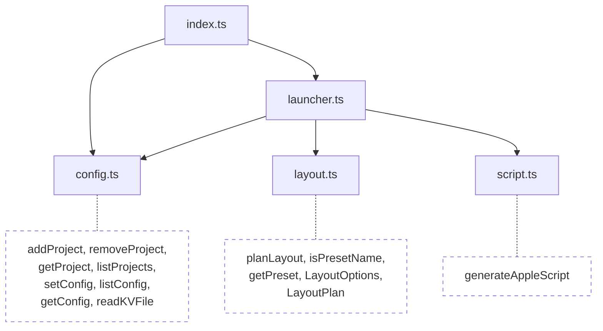
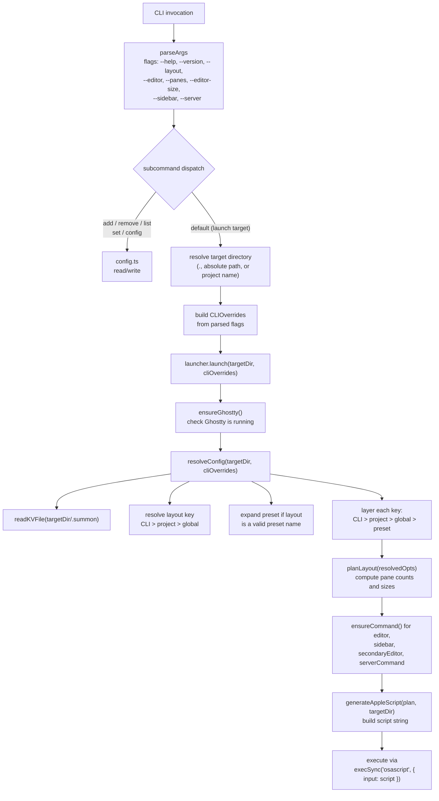
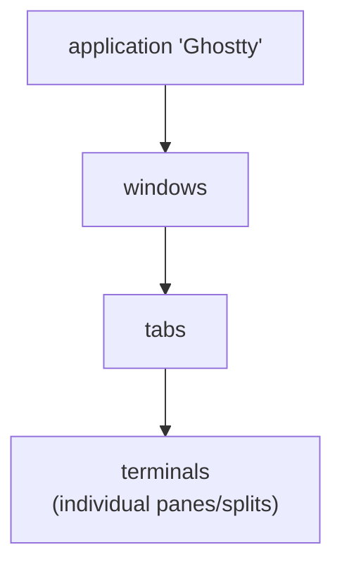

# Architecture

Technical reference for contributors.

## Module Map

```
src/
  index.ts       CLI entry point -- parseArgs, subcommand dispatch, CLI overrides
  config.ts      Config file read/write (~/.config/summon/ and .summon)
  layout.ts      Layout calculation, presets (pure functions, no side effects)
  script.ts      AppleScript generator (pure function -- builds script string from LayoutPlan)
  launcher.ts    Orchestrator: config resolution, command checks, script execution via osascript
  globals.d.ts   Build-time constant declarations (__VERSION__)
  *.test.ts      Co-located unit tests (vitest)
```

### Dependency Graph



`layout.ts` and `script.ts` are pure modules with no imports from the project. `config.ts` only uses Node stdlib. `launcher.ts` depends on `config.ts`, `layout.ts`, and `script.ts`.

## Data Flow



## AppleScript Generation

`script.ts` exports a pure function `generateAppleScript(plan, targetDir)` that returns a string. The generated script:

1. Creates a `surface configuration` with the target working directory
2. Creates a new Ghostty window with that configuration
3. Captures the root terminal (first pane)
4. Splits for sidebar (direction `right`)
5. Splits for right column editors (direction `right` from root)
6. Splits left column vertically for additional editor panes (direction `down`)
7. Splits right column vertically for additional editors + server (direction `down`)
8. Sends commands to each pane via `input text` + `send key "enter"`
9. Focuses the root editor pane

### AppleScript Object Model



Key commands used:
- `new surface configuration` -- create config with working directory, command, etc.
- `new window with configuration` -- create window
- `split <terminal> direction <dir> with configuration` -- create split
- `input text "<cmd>" to <terminal>` -- send command text
- `send key "enter" to <terminal>` -- press enter
- `focus <terminal>` -- focus a pane

### No tmux, No Session Persistence

Unlike termplex, summon does not create persistent sessions. Each `summon` invocation creates a new Ghostty window with splits. Closing the window ends everything. There is no detach/reattach. This is a Ghostty limitation -- if they add session persistence in the future, summon can adopt it.

## Config Resolution

`resolveConfig()` in `launcher.ts` merges configuration from multiple sources:


1. Read project `.summon` file via `readKVFile(join(targetDir, ".summon"))`
2. Resolve the `layout` key (CLI > project > global) and expand the matching preset as a base
3. For each config key (`editor`, `sidebar`, `panes`, `editor-size`, `server`), pick the highest-priority value
4. Return partial `LayoutOptions` -- `planLayout()` fills remaining defaults

## Layout Presets

Defined in `layout.ts` as a `Record<PresetName, Partial<LayoutOptions>>`:

| Preset | `editorPanes` | `server` | `secondaryEditor` |
|---|---|---|---|
| `minimal` | 1 | `"false"` | |
| `full` | 3 | `"true"` | |
| `pair` | 2 | `"true"` | |
| `cli` | 1 | `"npm login"` | |
| `mtop` | 2 | `"true"` | `"mtop"` |

## Layout Algorithm

Given `N` editor panes (default 3) and server toggle:

1. **Left column**: `ceil(N/2)` editor panes
2. **Right column**: `N - ceil(N/2)` editor panes + (1 server pane if `hasServer`)
3. **Sidebar**: separate column at `100 - editorSize`% width

### Server Pane

| Input | `hasServer` | `serverCommand` |
|---|---|---|
| `"true"` | `true` | `null` (plain shell) |
| `"false"` or `""` | `false` | `null` |
| anything else | `true` | the input string |

### Secondary Editor

`secondaryEditor` allows a preset to specify a different command for right-column editor panes. Used by the `mtop` preset to run `mtop` in the right column while the left column runs the primary editor.

### Split Percentage Formula

When splitting `N` panes into a column, each split uses:

```
pct(i) = floor((N - i) / (N - i + 1) * 100)
```

where `i` is the 1-based index of the split. This produces equal-height panes.

## Config Storage

### Machine-level

Config files live at `~/.config/summon/`:

| File | Purpose |
|---|---|
| `config` | Machine-level settings (editor, sidebar, panes, editor-size, server, layout) |
| `projects` | Project name-to-path mappings |

Both use `key=value` format, one entry per line.

### Per-project

A `.summon` file in the project root uses the same `key=value` format.

## Build Pipeline

1. **tsup** compiles `src/index.ts` to `dist/index.js` (ESM, target node18)
2. **Shebang injection**: `#!/usr/bin/env node` banner prepended
3. **Version injection**: `__VERSION__` replaced with `package.json` version at build time
4. **prepublishOnly**: runs `pnpm run build` before any `npm publish`

The `files` field in package.json limits the published package to `dist/` only.
